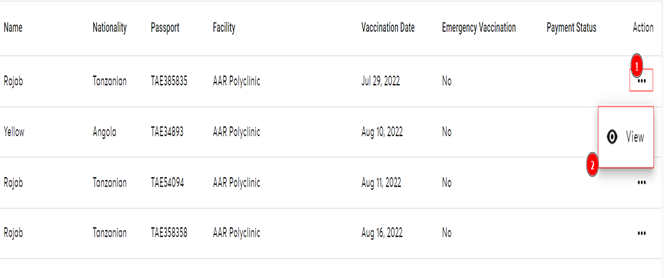
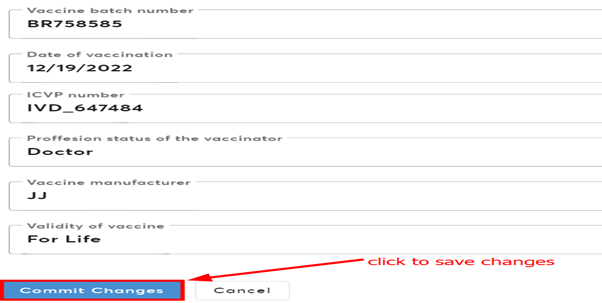
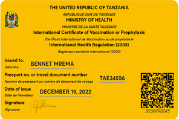
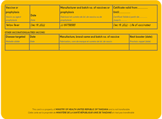
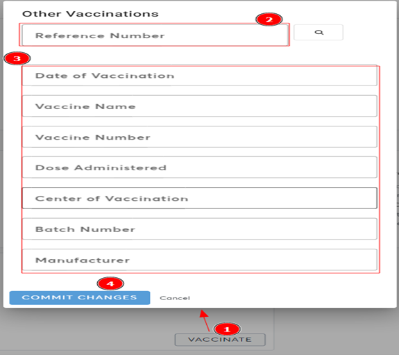

- Step 1: Open a web browser
- Step 2: Type the Url (https://afyamsafiri-admin.moh.go.tz/) on your browser.
- Step 3: Enter username and password and click “sign in”
- Step 4: Select the afyamsafiri manager from the application manager or from the search tab as shown in Figure 4.1.
- Step 5: Click “Yellow fever” from the left side bar of the dashboard
- Step 6: Filter and click the name of the client to be attended (refer Sect ...). 
- Step 7: Review client’s profile to verify the filled information and edit by clicking the “edit” icon if required.
- Step 8: Click “assess now” for clinical assessment
- Step 9: Click to fill all fields in the pop-up window about clinical assessment (Figure 4.2.2b). 

NB: In case of “YES” response in the clinical assessment, the vaccination panel will not appear.
- Step 10: Click “commit changes” button to save the information.
- Step 11: Click “vaccinate” on the vaccination panel for vaccination
- Step 12: Click to fill all fields in the pop-up window about the vaccine (Figure 4.2.2b). 
- Step 13: Click “commit changes” to save the information.
- Step 14: Click “vaccinate” on other vaccination panel to include other vaccinations
- Step 15: Click to enter COVID-19 reference number to acquire COVID-19 vaccination details from CHANJOCOVID System (Figure 4.2.2b). 
- Step 16: Click “commit changes” to save the information.
- Step 17: Click “view certificate” at the right side of the screen to access the certificate.
- Step 18: Click “download certificate” to save as PDF or print.

## In case of exemption certificate

- Step 1: Click “assess now” for clinical assessment
- Step 2: Click to fill all fields in the pop-up window about clinical assessment (Figure 4.2.2b). 
- Step 3: Click “commit changes” to save the information.
- Step 4: Click “vaccinate” on other vaccination panel to include other vaccinations
- Step 5:Click to enter COVID-19 reference number to acquire COVID-19 vaccination details from CHANJOCOVID System (Figure 4.2.2b). 
 Step 6: Click “commit changes” to save the information.
- Step 7: Click “view certificate” at the right side of the screen to access the certificate.
- Step 8: Click “download certificate” to save as PDF or print.

## In case of booking has not been made by client

- Step 1: Open a web browser
- Step 2: Type the Url (https://afyamsafiri-admin.moh.go.tz/) on your browser.
- Step 3: Enter username and password and click “sign in”
- Step 4: Select the afyamsafiri manager from the application manager or from the search tab as shown in Figure 4.1.
- Step 5: Click “Yellow fever” from the left side bar of the dashboard
- Step 6: Click “add Yellow Fever” to open yellow fever booking form.
- Step 7: Enter passport number or ID and click search
- Step 8: Click to fill all fields in the yellow fever vaccination form on demographic information and clinical information.
- Step 9: Click “submit” to save the information.

Figure: Form for filling in details for yellow fever booking placing a book

NB: If the “submit button” is not active – review the responses and ensure all the required fields marked with an asterisk sign (*) are completed.

- Step 10: Click (√) in the declaration note and then click “complete” to save the details.

NB: Filled details will be saved only when they see form completion notice. If you click “close” the information will be lost.

Figure 3.2.5: Screenshot of traveler’s form completion notice (add instruction tick here)

Screenshot: Form completion notice and information page (click here to edit)

## 4.4. Card Replacement

- Step 1: Open a web browser
- Step 2: Type the Url (https://afyamsafiri-admin.moh.go.tz/) on your browser.
- Step 3: Enter username and password and click “sign in”
- Step 4: Select the afyamsafiri manager from the application manager or from the search tab as shown in Figure 4.1.
- Step 5: Click “card placement” from the left side bar of the dashboard
- Step 6: Filter and click the name of the client to be attended (refer Sect ...).

Figure 4.3a: Selecting yellow fever menu to attend a client who booked for vaccination

### Step 2:
Select client from the list by clicking ellipsis button (“...”) for the desired client (Figure 4.3b)

Figure 4.3b: Accessing a client from the list

### Step 3:
Verify clinical assessment details as was filled by the client during booking. Make necessary changes if required (Figure 4.3c)

Figure 4.3c: Clinical assessment questions

### Step 4:
Fill in the details about the vaccine given to the client, including the date of vaccination, vaccine batch number, professional status of the vaccinator, vaccine manufacturer, and the validity of the vaccine (Figure 4.3d). Once done, submit the information by clicking the “commit changes” button, and the system will generate the International Certificate of Vaccination or Prophylaxis (ICVP).

Figure 4.3e: Filling in vaccination information

### Step 5:
Generate the certificate by clicking the “View certificate” button seen on the right of the screen. The certificate contains details about the client including names, passport or travel document number, date of issue, and client's signature.

### Step 6:
Print the vaccination card and provide it to the client after confirmation of payments has been done.

Figure 4.3f: Opening certificate

## Other Vaccination Information

To add other vaccination information to the generated ICVP, follow the steps below:

- Step 1: Click the “vaccinate” button to open the view containing the details for other vaccinations.
- Step 2: Search vaccination information using IVD reference number.
- Step 3: Verify the details that will be pre-filled to see if they are valid for the client who requested the ICVP.
- Step 4: Save the information so that it is attached to the ICVP.

Figure 4.3g: Form for filling in the details for other vaccination

---

